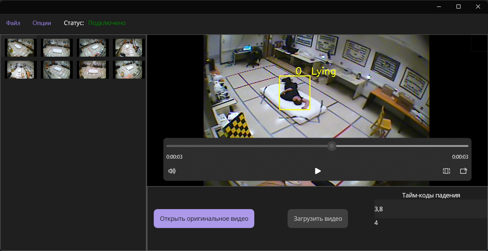

<strong>Описание решения</strong>

<strong>Хакатон технологического акселератора ML START 6-7 апреля 2024 г.</strong>

## Хакатон
Ссылка на ТЗ: https://github.com/MetaException/mlstart_hackathon/blob/master/technical_specifications.md

Репозиторий api-сервиса с нейросетью: https://github.com/Painzxc/service/

## Описание решения

Этот репозиторий содержит проект api_client - клиент для работы с api-сервисом.

Клиент разбивает выбранный пользователем видео-файл на кадры, и в цикле, с установленной задержкой (в секундах), отправляет кадры из видео на обработку нейросети на api сервисе, и получает имя класса объектов, id человека и координаты box для обводки. 

После получения данных о кадре, изменяет текущий кадр, отрисовывая на нём boundingbox и классы, вставляет их в новое видео. На выходе получается обработанный видео-файл, который проигрывается в окне программы.

Пользователь может также по нажатию кнопки переключаться между просмотром оригинального видео файла и обработанного. При этом видео просто будет загружаться с диска по пути.

Пользователь может сохранить обработанный файл по нажатию кнопки «Сохранить», в этом случае откроется диалоговое окно с выбором пути сохранения. 

Пользователь может настроить интервал между отправками кадров относительно видео (от отправки каждого кадра видео до отправки кадра раз в секунду), при изменении интервала, выбранное значение будет сохранено в файле конфигурации.

## Используемый стек
* .NET 8, [.NET MAUI](https://github.com/dotnet/maui), паттерн – MVVM

### Основные используемые библиотеки:
* CommunityToolkit.Mvvm - инструменты и шаблоны для реализации паттерна (Model-View-ViewModel)
* OpenCVSharp4 – Привязка к библиотеке компьютерного зрения OpenCV, используется для обработки кадров видео
* Serilog – Библиотека для логирования
* CommunityToolkit.Maui.MediaElelement – Используется для реализации плеера видео

## Логи
* При запуске из VS папка logs появляется в запущенного проекта. 
* При запуске exe, папка logs появляется в папке запущенного exe.

### Логи клиента:
Папка logs

## Файл конфигурации:
Папка Configuration/appsettings.json

## Не сделано
* Сохранение стоп-кадра значимого события в БД (значимое событие – момент падения);
* Просмотр журнала событий (название источника, стоп-кадр, метаданные алгоритмов);
* Полноценный просмотр видео в процессе обработки
* Работа с api используя 2 вебсокета (получение и отправка)
* Откат определённых настроек программы до дефолтных, если установлено некорректное значение
* В коде: TODOs
* В коде: нет комментариев, нет регионов, да и сам код написан на скорую руку;

## Скриншот работы программы

